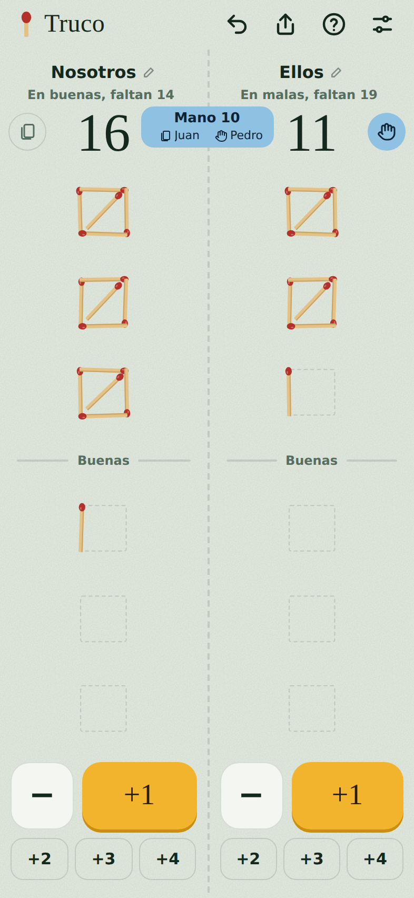
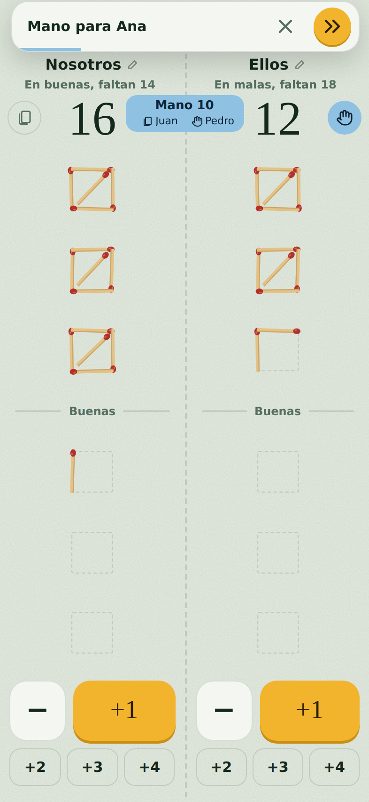
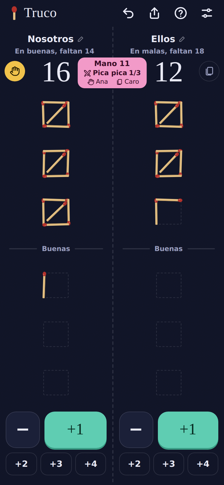
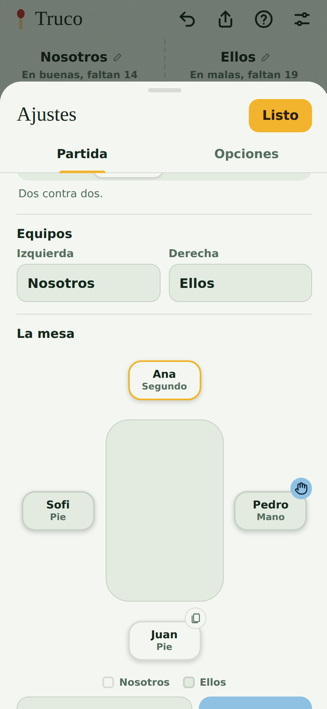

# Anotador de truco

Los fósforos de siempre, en el celular apoyado en la mesa. Tocás la columna de tu equipo
para sumar, mantenés para borrar, y el anotador se encarga del resto: malas y buenas,
quién es mano, el pica pica y quién gana.

**[Abrir el anotador](https://ewajs.github.io/truco/)** · [Manual](#manual)

| | | | |
|:-:|:-:|:-:|:-:|
|  |  |  |  |
| Una partida en buenas | La mano pasa sola | Pica pica de a 6 | La mesa |

- **Rápido**: un toque, un punto. +2, +3 y +4 para el envido o el truco de una vez.
- **Sigue la mano**: quién es mano y quién da, la pasa solo después de anotar, y de a 6 u
  8 lleva el pica pica.
- **La mesa**: los jugadores en sus lugares, los equipos cruzados y tirar reyes.
- **Tuyo**: cuatro temas, claro u oscuro, y lo que no uses se apaga.
- **Anda siempre**: se instala como app, funciona sin conexión y guarda la partida sola.

## Manual

1. [Empezar](#empezar)
2. [Anotar](#anotar)
3. [Malas y buenas](#malas-y-buenas)
4. [La mano](#la-mano)
5. [Pica pica](#pica-pica)
6. [La mesa](#la-mesa)
7. [Compartir](#compartir)
8. [Opciones](#opciones)
9. [Tus datos](#tus-datos)

### Empezar

Abrí [ewajs.github.io/truco](https://ewajs.github.io/truco/) en el celular. Para tenerlo
como app, con el ícono en la pantalla de inicio y sin la barra del navegador:

- **Android (Chrome)**: tocá **Instalar** en el aviso que aparece, o en el menú del
  navegador, **Instalar app**.
- **iPhone (Safari)**: **Compartir → Agregar a inicio**.

En **Ajustes → Partida** elegís a cuántos puntos (15 o 30) y de a cuántos se juega (2, 4, 6
u 8). Los nombres de los equipos se cambian ahí o tocándolos en el tablero.

### Anotar

- **Tocá la columna** de un equipo para sumar un punto. Cada cuadrado de fósforos son 5.
- **Mantené apretado** para borrar; si seguís apretando, sigue borrando.
- **+1, −, +2, +3 y +4**: los botones de abajo, para anotar varios de una.
- **Deshacer** (arriba) vuelve atrás el último cambio de puntos.

Al llegar a los puntos aparece el ganador; se suma a sus partidas ganadas y se puede
arrancar otra.

### Malas y buenas

A 30 se juega en malas (los primeros 15) y buenas (los otros 15). La línea **Buenas**
separa las dos mitades y arriba del puntaje dice en cuál está cada equipo y cuánto le
falta. A 15 es una sola vuelta.

### La mano

- El círculo al lado del puntaje muestra qué equipo es **mano**; el otro tiene el
  **mazo**. Tocalo para pasar la mano a mano.
- El **chip del medio** dice qué mano se juega ("Mano 7"), quién es mano y quién da, cada
  uno del lado de su equipo. Tocalo para corregir cualquier cosa: quién es mano, el número
  de mano o si es de pica pica.
- **La mano pasa sola** unos segundos después del último punto (3, 5, 8 o 12, se elige
  en Opciones). Antes de pasar aparece un aviso arriba para **pasarla ya** o
  **cancelar**; después, uno para **deshacer**.
- Borrar o deshacer puntos nunca pasa la mano: se entiende que fue un toque de más.

### Pica pica

De a 6 u 8, desde que alguien llega a 5 y hasta que alguien llega a 25, se alterna una
mano redonda y una de pica pica. El chip se pinta de otro color y dice qué duelo se juega:

- **De a 6**: tres duelos, cada uno contra el de enfrente. Arranca el de la mano y siguen
  en orden, así que siempre te toca el mismo rival.
- **De a 8**: dos duelos de dos contra dos, con los primeros cuatro desde la mano y los
  otros cuatro. Las parejas rotan.

Cada pase de mano cierra un duelo; cuando se jugaron todos, la mano pasa como siempre. El
pica pica se puede apagar en **Ajustes → Partida**.

### La mesa

En **Ajustes → Partida → La mesa** están los jugadores sentados alrededor, en el orden en
que se juega. Los equipos se cruzan, así cada uno tiene un rival a cada lado y el
compañero enfrente. Cada lugar dice su turno: **Mano**, **Segundo**, **Tercero**… y
**Pie**, el último de cada equipo en jugar (el mazo lo tiene el último pie).

- Tocá un lugar para cambiarle el nombre o **hacerlo mano**.
- Tocá dos lugares para **cambiarlos de lugar** (y quizá de equipo).
- **Tirar reyes** sortea los lugares y la mano.

Todo se puede cambiar en medio de la partida: los puntos no se tocan.

### Compartir

El botón de compartir (arriba) manda el link del anotador o **la partida como está**:
puntos, ganadas, nombres y la mesa. Quien abre el link elige si la carga.

### Opciones

En **Ajustes → Opciones**:

- **Tema** (Paño, Madera, Noche o Argento) y **modo** (Auto, que sigue al celular, Claro u Oscuro).
- **Pantalla**: mostrar los números y los botones. Sin botones se anota solo tocando y
  manteniendo.
- **Mano**: seguir las manos (apagado, el anotador solo cuenta puntos), mostrar quién es
  mano, pasarla sola y cuánto esperar, y el aviso antes de pasarla.
- **Celular**: vibrar al anotar y mantener la pantalla encendida, si el celular lo
  permite.

### Tus datos

La partida y las opciones se guardan en el celular, en el navegador. No hay cuentas ni
servidor: nada sale del teléfono salvo que compartas un link.

---

¿Querés colaborar o ver cómo está hecho? Es un sitio estático, sin build: `npm start` lo
levanta y `npm test` corre los tests. Los detalles están en [CLAUDE.md](CLAUDE.md).
